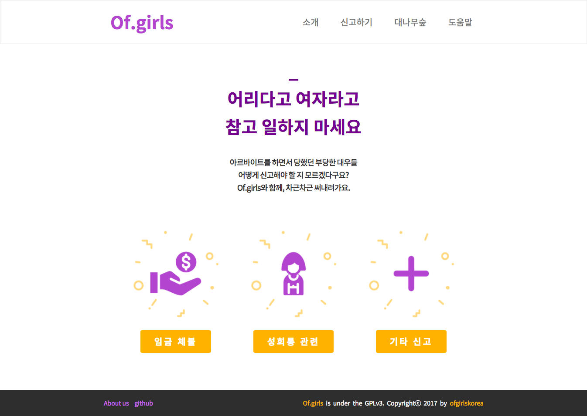
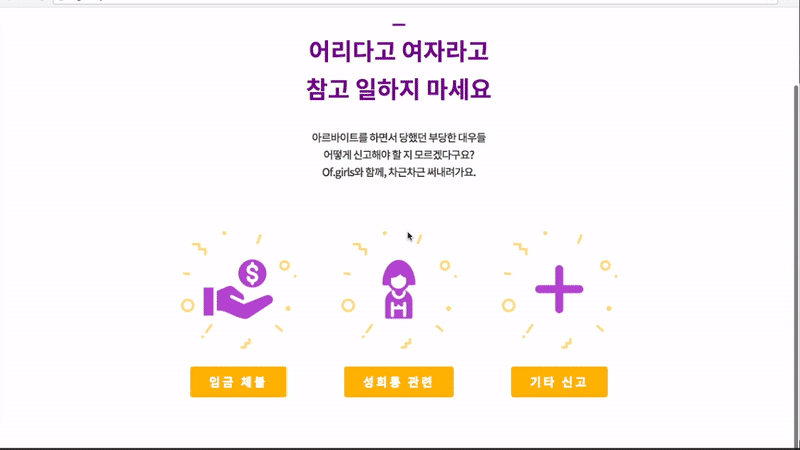

# Of.girls

> 🎀 소녀들이여 당당하게 일하자! **Of.girls**와 함께하세요! 🎀 

[](http://ofgirls.xyz)

Of.girls 는 Opportunity for girls의 줄임말로써, 최저임금 미준수, 임금체불 등 
부당한 근로 환경과 성범죄 위험에 노출되어 있는 여성 청소년들의 근로 처우 개선을 위한 플랫폼입니다.

서류 작성에 미숙한 청소년들이 신고서를 양식에 맞추어 작성할 수 있도록 form을 제공하는 웹 어플리케이션입니다.
 


## How to use


[ofgirls.xyz](http://ofgirls.xyz)에 접속하셔서, 필요한 신고서를 작성해보세요.

홈페이지에서 **[신고하기]** 메뉴를 눌러 선택지를 고르면 됩니다.

자세한 방법은 **[도움말]** 항목을 참고하세요!

**[대나무숲]** 에 가시면 그동안 말하지 못한 이야기들을 익명으로 나눌 수 있습니다.


## Prerequirements

* mysql 5.7 이상

## How to install for Localhost
1. ZIP 파일을 다운로드 받습니다.

2. python 모듈 의존성을 다음과 같이 모두 설치해줍니다.
```
pip3 install -r requirements.txt
```
(이 때, ofgirlskorea>setting.py의 database 설정에 맞춰 DB를 생성해줍니다.)
```python
DATABASES = {
    'default': {
        'ENGINE': 'django.db.backends.mysql',
        'NAME': 'Ofgirlskorea',
	'USER': 'root',
	'PASSWORD': 'Ofgirlskorea!',
	'HOST': 'localhost',
	'PORT': '3306',
    }
}
```

3. ofgirlskorea 디렉토리에서 다음을 수행합니다.
```python
python manage.py runserver
```

4. 로컬호스트에서 홈페이지 결과를 확인합니다.
> 127.0.0.1:8000

## Copyright of image and plugin
* 버튼 아이콘 이미지 : [bootstrap Glyphicon](http://glyphicons.com/)

* timepicker : [wickedpicker](https://github.com/ericjgagnon/wickedpicker)

* datepicker : [bootstrap-daterangepicker](https://github.com/dangrossman/bootstrap-daterangepicker/)

* validation : [jQuery Validation Plugin](https://jqueryvalidation.org/)

* Cookie : [js-cookie](https://github.com/js-cookie/js-cookie)

* clipboard : [clipboard.js](https://github.com/zenorocha/clipboard.js/)

* 타임라인 css : [CAPTAIN ANONYMOUS](https://codepen.io/)


## License
Of.girls is under the [GPLv3](LICENSE).

Copyright (c) 2017 ofgirlskorea
